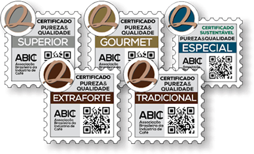

+++
date = '2025-09-28T16:20:54-03:00'
draft = true
title = 'Como o café me mudou e me deu vontade de acordar de mais cedo'
categories = 'pessoal'
featured_image = 'home-cafe.jpg'
tags = ['café']
+++

Nos últimos meses, tenho sentido que estou em um platô. Minhas noites não são tão boas, meu sono não rende, e acordar cedo e disposto para trabalhar tem sido um desafio constante. Às vezes, até penso que posso estar entrando em uma fase introdutória de burnout — nada grave, mas suficiente para me deixar alerta.

Mas este post não é sobre burnout. É sobre um pequeno hábito que tem me ajudado a transformar, aos poucos, minhas manhãs: o café.

### Minha relação complicada com o café

Se você me conhecesse alguns anos atrás, nunca imaginaria que eu estaria escrevendo um post desses. Eu odiava café. O gosto era amargo demais, parecia carvão líquido. Para conseguir engolir, colocava três colheres de açúcar em cada xícara. Só assim descia.

Além do sabor, ainda tinha os efeitos colaterais: meu coração acelerava, a ansiedade batia forte, e às vezes até sentia uma arritmia leve depois de uma simples xícara. Para mim, café era sinônimo de mal-estar.

### O que mudou

Com o tempo, percebi que talvez não fosse o café em si o problema, mas a qualidade do café e como eu estava consumindo. Decidi dar uma segunda chance. Testei diferentes formas de preparo, tomei coragem de comprar um café no minimo Gourmet, uma classificacao acima do tradicional, e comecei a tomar em momentos mais adequados.

De repente, o café deixou de ser um inimigo e começou a se tornar um aliado.

### Os benefícios que percebi

Ainda estou longe de ter uma rotina matinal perfeita, mas algumas mudanças já ficaram claras:
- Mais disposição para começar o dia. Aquela primeira xícara funciona quase como um empurrãozinho para sair da inércia.
- Menos açúcar na rotina. Aprendi a apreciar o sabor do café sem precisar exagerar no doce.
- Um ritual para minhas manhãs. Preparar o café virou parte da minha rotina, um momento meu antes de mergulhar no trabalho.
- Minha rotina de ir no banheiro também melhorou. Parece que estou mais amigo do meu intestino.

Tudo isso aconteceu pois eu melhorei a qualidade do café horrivel que estava consumindo. Sei que isso virou mais que uma vontade ou rotina, virou um hobbie, estudar e ver sobre café é uma coisa prazerosa que alegra meus dias.

### Qualidade dos cafés brasileiros

Não sei se todos aqui sabem, mas o Brasil é o maior exportador de café do MUNDO, com grãos de altíssima qualidade. Porém, quando falamos em mercado interno, muitas vezes ficamos restritos a cafés de baixa qualidade.

Hoje, temos uma instituição chamada ABIC (Associação Brasileira da Indústria do Café). Ela criou uma classificação para ajudar o consumidor brasileiro a escolher cafés com um mínimo de garantia de qualidade.

Vou deixar aqui uma descrição pessoal dos tipos de café, do mais simples ao mais refinado:

#### 1. Extraforte

Esse aqui é o fundo do poço da qualidade. Normalmente feito com grãos defeituosos e cheios de impurezas, por isso são super torrados (ou “hypertorrados”), o que dá aquele sabor amargo e queimado. A torra muito escura serve para mascarar os defeitos e uniformizar o gosto. Resultado: café pesado, forte, mas sem nenhuma sutileza.

#### 2. Tradicional

É o que a maioria dos brasileiros consome no dia a dia. Geralmente feito de uma mistura de grãos arábica (de melhor qualidade) e robusta (mais amargo e encorpado). Ainda pode ter alguns defeitos, mas em menor quantidade que o extraforte. Costuma ter um sabor forte, amargo e marcante, mas já menos agressivo. É aquele café “do escritório” ou “de casa” que a gente encontra facilmente no supermercado.

#### 3. Superior
Um degrau acima do tradicional. Produzido com uma seleção mais cuidadosa, utilizando pelo menos 85% de grãos arábica de melhor qualidade. A torra é menos agressiva e o resultado é um café mais suave, aromático e agradável, mantendo ainda um preço acessível.

#### 4. Gourmet (atualmente é daqui onde eu compro meu café)

Aqui a coisa já melhora bastante. O café gourmet é feito exclusivamente com grãos arábica selecionados, livres de impurezas e defeitos graves. A torra é mais controlada, valorizando o sabor natural do grão. Isso dá uma bebida mais equilibrada, com notas perceptíveis de chocolate, frutas secas ou caramelo, dependendo da região de origem. É o café ideal para quem quer sair do básico e experimentar algo de mais qualidade.

#### 5. Especial

O topo da cadeia. O café especial passa por um processo rigoroso de seleção e avaliação, seguindo padrões internacionais. Para ser considerado especial, precisa alcançar mais de 80 pontos em uma escala sensorial que avalia aroma, corpo, acidez, doçura e uniformidade. São cafés com sabores únicos e complexos, que podem trazer notas florais, frutadas e até vínicas. É aquele café para ser apreciado com calma, muitas vezes vendido em microlotes ou com indicação da fazenda produtora.

### Minha receita

Vale lembrar que eu comecei a tomar cafés melhores agora, então ainda não tenho equipamentos nem métodos mirabolantes. Mas acho interessante passar a receita que eu estou fazendo, principalmente para ter um grau de compraraćão para o futuro.

Equipamentos:
- Leiteira
- Coador melita (direto numa garrafa)

### Conclusão

Hoje, o café é mais do que uma bebida: é um símbolo de mudança gradual. Ainda estou em processo, mas sinto que esse hábito está me ajudando a criar manhãs mais leves e produtivas.

Quem sabe, no futuro, eu consiga dormir melhor, acordar mais cedo e com energia — e olhar para trás entendendo que tudo começou com uma simples xícara de café.